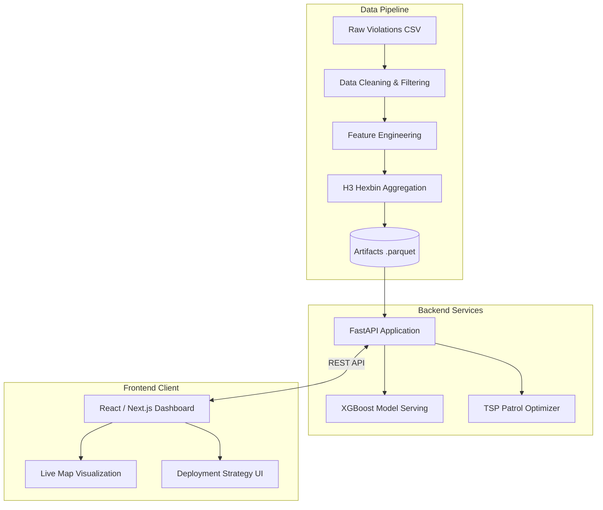
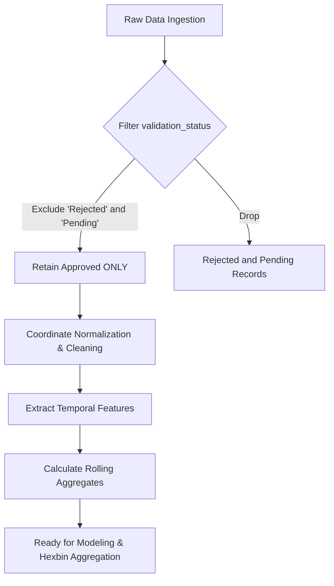

# Trinetra: AI-Driven Parking Intelligence
**Transforming reactive traffic enforcement into a predictive, targeted operation for Bengaluru.**

## Problem Statement
Bengaluru suffers from severe traffic congestion exacerbated by systemic, illegal parking. Currently, traffic police rely on reactive, roaming patrols with no systematic way to prioritize high impact areas. Manual enforcement leaves significant blind spots and fails to prevent bottleneck formations. Without spatial intelligence or temporal forecasting, law enforcement struggles to deploy their limited resources efficiently, allowing chronic violation hotspots to persist and disrupt major arterial routes.

## Solution Overview
Trinetra is an end to end intelligence platform that converts raw parking violation logs into actionable deployment strategies. The system ingests historical coordinate data, cleans it, and identifies high density spatial hotspots. It then applies predictive modeling to forecast future violation spikes across specific hour blocks and days of the week. Finally, the platform optimizes patrol routes dynamically, clustering high priority areas into mathematically efficient loops. The entire workflow is accessible via a high performance FastAPI backend and an interactive Next.js dashboard, enabling station commanders to make data driven deployment decisions.

## Key Features
*   **H3 hexbin hotspot detection:** Partitions Bengaluru into resolution-9 cells (approximately 174 m edge) and aggregates violations per cell, producing a ranked list of hotspot zones.
*   **Composite congestion-risk score:** Assigns each hotspot a 0-100 impact index from four documented components: violation severity, log-normalised density, vehicle blocking weight, and junction-proximity bonus.
*   **Temporal analysis:** Builds hour-of-day by day-of-week count matrices per hotspot and exposes them as heatmaps. Treats all timestamps as logging-activity signals, not as violation-occurrence times (see Limitations).
*   **Afternoon enforcement blind-spot detection:** Computes the fraction of violations logged between 13:00 and 16:59 IST across each station. Near-zero values confirm a near-total absence of afternoon enforcement.
*   **Weekly escalation forecasting:** An XGBoost count:poisson model trained on lag features, a 4-week rolling mean, and static hotspot attributes predicts next-week violation counts per hotspot. Escalating hotspots are flagged by percentage change and absolute volume tier.
*   **Greedy spatial patrol optimiser:** Given N units, assigns each unit to the highest-priority uncovered hotspot and extends the route to up to four nearby stops within 2 km using a nearest-neighbour ordering. Hotspots within 1 km of any route point are marked covered.
*   **POI spillover tagging:** Keyword-matches officer-logged location text to classify each hotspot into one of four categories: sensitive (schools, hospitals), metro, commercial, or transit. No external geofencing database is used.
*   **Repeat-offender analytics:** Aggregates violation counts per vehicle identifier and surfaces chronic offenders and their preferred locations. All vehicle identifiers are PII-masked in API output.
*   **Enforcement-quality reporting:** Computes per-station rejection rates from the `validation_status` field to surface where the reporting pipeline is weakest.
*   **Station and junction rollups:** Aggregates hotspot and violation metrics by police station (53 stations) and by named junction for command-level views.

## System Architecture



## Data Pipeline Flowchart



*(Note: The above diagram reflects the original pipeline design. As noted in the Limitations section below, the core analysis was later adjusted to use only approved rows due to a source pipeline backlog issue.)*

## Methodology

### Risk Score Formula

Each hotspot receives a composite 0-100 risk score from four components. All weights are in `backend/app/core/config.py` and can be adjusted without modifying scoring logic.

```text
risk_score = (severity_score_agg  x 0.40)
           + (density_score        x 0.25)
           + (vehicle_score_agg   x 0.20)
           + (junction_input      x 0.15)

Clamped to [0, 100].
```

| Component | Range | Description |
|---|---|---|
| `severity_score_agg` | 0-100 | Mean per-violation severity, normalised. PARKING IN A MAIN ROAD = 100. NO PARKING = 33. |
| `density_score` | 0-100 | Log-normalised violation count. `log1p(count) / log1p(max_count) x 100`. |
| `vehicle_score_agg` | 0-100 | Mean carriageway-blocking weight, normalised. Tanker/HGV = 100. Scooter = 30. |
| `junction_input` | 0 or 25 | Flat bonus of 25 when at least 50% of the hotspot's violations carry a named junction, otherwise 0. Max contribution: 3.75 points. |

### Escalation Forecasting

The forecast model trains once per server process on a weekly panel built from `violations.parquet`. To avoid data leakage, lag features use only weeks that precede the training cutoff. Weeks W06-W10 and W12-W13 are excluded from training because over 80% of their rows have null `validation_status` due to an approval-system backlog in the source data (raw data volume is normal; only the approval pipeline was lagged).

*   **Training features:** lag1-lag4 weekly counts per hotspot, 4-week rolling mean, calendar month, risk score, violation severity, junction flag, POI flag.
*   **Model:** XGBoost with `count:poisson` objective. 200 estimators, max depth 5, learning rate 0.05, subsample 0.80, colsample_bytree 0.80.
*   **Evaluation holdout:** W03-W04 (two clean weeks before the W06 gap).
*   **Results on clean holdout:** XGBoost MAE 5.26 violations per hotspot. 4-week rolling mean baseline MAE 5.25. Last-week naive baseline MAE 6.17. Precision@10: 0.60. Precision@20: 0.60.
*   **Displayed prediction:** The 4-week rolling mean (W02-W05) is used for the displayed prediction because it matches XGBoost accuracy on this dataset and is trivially interpretable for a non-technical police audience.

Hotspots are classified into tiers based on percentage change vs. baseline and absolute violation volume:
*   Critical: more than 20% increase, baseline above 15 violations per week.
*   Rising: more than 15% increase.
*   Stable: between -15% and +15%.
*   Declining: more than 15% decrease.

### Composite Priority Score (Patrol Ranking)

The patrol optimiser ranks hotspots by `priority = risk_score x violation_count`, selects each unit's anchor as the highest-priority uncovered hotspot, and builds a route of up to five stops (anchor plus up to four candidates within 2 km, ordered by nearest-neighbour). Hotspots within 1 km of any route point are marked covered and excluded from subsequent unit assignments.

### Timestamp Logging vs. Occurrence

A critical finding from the data: `created_datetime` records when the enforcement officer logged the violation, not when the vehicle was parked. The dataset shows near-zero afternoon logging (13:00-16:59 IST) city-wide. This does not mean parking violations stop in the afternoon; it means enforcement officers are not logging in that window (shift patterns, junction-management duties, etc.).

All temporal analysis in this system is therefore labelled as logging coverage, not demand signal. `morning_log_pct` and `afternoon_log_pct` are coverage metrics. The `logging_window` label (`morning`, `overnight`, `split`, `afternoon`) describes when officers log, not when violations occur. Forecasts use these features as enforcement-activity proxies, not as parking-demand estimates.

## Model Performance

| Metric | XGBoost Model | Rolling Mean Baseline | Last-Week Naive |
| :--- | :--- | :--- | :--- |
| **MAE** | 5.26 | 5.25 | 6.17 |
| **Precision@10** | 0.60 | 0.00 | 0.20 |
| **Precision@20** | 0.60 | 0.00 | 0.20 |

*(Note: Results evaluated on clean holdout W03-W04)*

## Tech Stack


## Demo

**Live Application:** [DEMO_LINK_HERE]

## Screenshots

**Dashboard Overview**


**Live Map & Route Optimizer**


**Repeat Offenders Tracking**


## Installation and Setup

### Prerequisites
*   Python 3.11+
*   Node.js 18+

### Backend Setup
1.  Navigate to the project root and create a virtual environment.
    ```bash
    python -m venv .venv
    source .venv/bin/activate
    ```
2.  Install required dependencies.
    ```bash
    pip install -r requirements.txt
    ```
3.  Start the FastAPI server.
    ```bash
    uvicorn backend.app.main:app --port 8000 --reload
    ```

### Frontend Setup
1.  Navigate to the frontend directory.
    ```bash
    cd frontend_v2
    ```
2.  Install dependencies.
    ```bash
    npm install
    ```
3.  Configure environment variables in a `.env` file.
    ```env
    NEXT_PUBLIC_API_URL=http://localhost:8000
    ```
4.  Start the development server.
    ```bash
    npm run dev
    ```

## API Reference

All endpoints return JSON. Base URL defaults to `http://127.0.0.1:8000`.

| Method | Path | Query parameters | Returns |
|---|---|---|---|
| GET | `/` | | Health check. Hotspot and violation row counts. |
| GET | `/stats` | | Total violations, total hotspots, date range, per-vehicle/violation/station breakdowns, afternoon blind-spot percentage. |
| GET | `/hotspots` | `police_station`, `violation_type`, `vehicle_type`, `min_risk` (float, default 0), `poi_category` (sensitive/metro/commercial/transit), `limit` (default 500, max 1200) | Filtered hotspot list with coordinates, risk scores, and logging window. |
| GET | `/heatmap` | Same filters as `/hotspots` | Lat/lng/weight tuples for a Leaflet heatmap layer. |
| GET | `/priority` | `police_station`, `vehicle_type`, `limit` (default 50, max 500) | Hotspots ranked by risk score with Critical/Elevated/Standard tier labels based on P99/P90 percentiles. |
| GET | `/temporal/{hotspot_id}` | | Hour x day-of-week count matrix for one hotspot. |
| GET | `/forecast` | `top_n` (default 20, max 2000) | Next-week predicted violation counts per hotspot. Includes model MAE, baseline comparisons, precision-at-N, escalation tiers, and citywide summary. |
| GET | `/patrol` | `units` (default 10, max 100) | Greedy patrol assignments for N units. Returns coverage percentage, naive baseline comparison, per-unit routes with geometry, and a coverage curve. |
| GET | `/stations` | `min_hotspots` (default 1), `limit` (default 53, max 200) | Per-station rollup: hotspot count, average risk, max risk, dominant violation, blind-spot percentage. |
| GET | `/junctions` | `min_violations` (default 1), `limit` (default 100, max 500) | Named-junction rollup: violation count, average risk, top hotspot. |
| GET | `/repeat-offenders` | `limit` (default 20, max 100) | Top repeat vehicles by violation count. Vehicle numbers are PII-masked. Includes dataset-wide repeat-offender share. |
| GET | `/poi-stats` | | Per-category counts, total violations, and average risk score for sensitive/metro/commercial/transit. |
| GET | `/enforcement-quality` | | Per-station rejection rates derived from `validation_status`. |

## Limitations and Honest Caveats

**Timestamp logging vs. occurrence.** `created_datetime` records when enforcement officers logged the violation, not when the vehicle was parked. Near-zero afternoon log counts reflect an enforcement absence, not an absence of parking violations. All temporal analysis is explicitly labelled as logging coverage.

**Approved-only filtering bias.** The core analysis uses only `validation_status == "approved"` rows. Weeks W06-W10 and W12-W13 have over 80% null validation status due to an approval-system backlog in the source pipeline, making them unreliable for training. The `--broad` flag in `build_dataset.py` includes unvalidated rows for sensitivity comparison.

**Congestion impact is a derived index, not a measured value.** The dataset contains no direct traffic-flow measurements (no speed, volume, queue length, or delay). The risk score is an interpretable proxy index combining severity, density, vehicle size, and junction proximity. It is presented as a prioritisation tool, not as a measured traffic-flow impact.

**Synthetic vehicle identifiers.** Vehicle numbers in the HackerEarth dataset follow a synthetic anonymised format (e.g. `FKN00GL*`). Repeat-offender frequency statistics are valid; the identifiers do not correspond to real vehicle registrations and no identity claim can be made.

**Small clean training window for forecasting.** Approximately four clean ISO weeks (W02-W05) are available for lag training after excluding degraded weeks. XGBoost and the 4-week rolling mean baseline are near-tied on this holdout, indicating the error is near the irreducible noise floor given the data volume. Accuracy will improve materially only with more clean weekly observations.

**Coverage percentage is runtime-computed.** The patrol optimiser's coverage figure depends on the number of units requested and the current hotspot dataset. It is not a fixed benchmark.

## Privacy and Data Handling

Vehicle numbers in the source dataset are synthetic anonymised identifiers provided by HackerEarth for the hackathon. They do not represent real vehicle registration plates. All API endpoints that return vehicle numbers apply an additional PII mask (e.g. `FKN00G****63`) before serving the response. No real personally identifiable information is stored, processed, or transmitted by this system.
 
