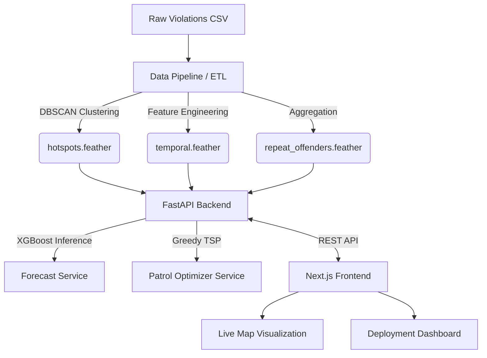

# Trinetra: Bengaluru Illegal Parking Intelligence

**Transforming reactive traffic enforcement into a predictive, targeted operation.**

<!-- TODO: Add build, license, and tech stack badges here -->

## Demo

<!-- TODO: Add live demo link here --> [Live Demo](#)
<!-- TODO: Add demo video/GIF here -->

## Overview

Trinetra solves the problem of poor visibility into parking induced congestion in Bengaluru. Currently, traffic police rely on reactive, roaming patrols with no systematic way to prioritize high impact areas. This system processes raw violation logs to detect spatial hotspots, quantify their congestion risk, and predict future spikes. By converting historical data into actionable intelligence, Trinetra enables law enforcement to deploy limited resources efficiently to the locations that matter most.

## Key Features

*   **Geospatial Hotspot Detection:** Uses DBSCAN clustering to identify dense groupings of illegal parking violations from raw coordinate data.
*   **Predictive Forecasting:** Implements an XGBoost model and Rolling Mean baseline to forecast violation spikes across specific hour blocks and days of the week.
*   **Advanced Patrol Routing (TSP Optimizer):** Dynamically groups 3 to 5 high priority hotspots into mathematically optimal patrol loops using a greedy Nearest Neighbor algorithm to maximize coverage.
*   **Repeat Offender Tracking:** Aggregates and anonymizes vehicle plate data to highlight chronic violators and their preferred locations.
*   **Interactive Operations Dashboard:** A Next.js frontend featuring a React Leaflet live map, deployment tables, temporal heatmaps, and POI spillover statistics.

## Data Insights: The "0% Afternoon Blind Spot"

During the development of Trinetra, our analytics engine uncovered a massive, systemic enforcement gap in the raw dataset. When visualizing the temporal distribution of over 112,000+ parking violations, the system reported a **0% Afternoon Blind Spot** on the main dashboard. 

Does illegal parking magically stop between 1 PM and 5 PM? Absolutely not. This 0% metric proves our core hypothesis: **there is virtually zero enforcement happening during the day**, likely due to shift changes, lunch hours, or traffic police being redirected to junction management instead of parking enforcement. 

Because almost 90% of the dataset's violations are logged overnight (8 PM to 7 AM), Trinetra's **Deployment Optimizer** is specifically designed to help station chiefs break this cycle. By allocating their limited patrol units mathematically across *all* high-risk temporal blocks, Trinetra allows commanders to finally close the blind spot.

## Architecture



The system is split into three main phases. First, an offline Python data pipeline ingests raw CSV logs, clusters coordinates, and precomputes artifacts into lightweight `.feather` files. Second, a FastAPI backend loads these artifacts into memory to serve REST endpoints and execute on the fly logic like patrol route optimization and XGBoost forecasting. Finally, a Next.js client consumes these APIs to render interactive maps and dashboards for the end user.

## Tech Stack

| Layer | Technology | Why it's used |
| :--- | :--- | :--- |
| **Data Engineering** | Python, pandas, scikit-learn | Efficient processing of 100k+ rows, DBSCAN clustering, and `.feather` file generation. |
| **Backend API** | FastAPI, Uvicorn | High performance REST API serving with automated OpenAPI schema generation and Pydantic validation. |
| **Machine Learning** | XGBoost | Provides robust gradient boosted regression for temporal violation forecasting. |
| **Frontend Framework** | Next.js (App Router), React | Server side rendering capabilities and modern component based UI architecture. |
| **Mapping & UI** | React Leaflet, Tailwind CSS | Interactive geospatial visualization of hotspots and rapid UI styling. |

## Folder Structure

```text
gridlock/
|-- backend/
|   |-- app/                  # FastAPI application, routers, schemas, and ML services
|   |-- data/                 # Raw datasets and compiled .feather artifacts
|   `-- pipeline/             # Python scripts for cleaning data and extracting features
|-- docs/                     # Project requirements and context documentation
|-- frontend_v2/              # Next.js web application and React components
|   |-- src/app/              # Route pages (Dashboard, Forecast, Map, Deploy, Offenders)
|   |-- src/components/       # Reusable UI elements (Sidebar, LiveMap, PriorityTable)
|   `-- src/lib/              # API client for backend communication
|-- notebooks/                # Jupyter notebooks for Exploratory Data Analysis (EDA)
`-- requirements.txt          # Python dependency lockfile
```

## Getting Started

### Prerequisites
*   Python 3.11+
*   Node.js 18+
*   npm or yarn

### Installation

1.  **Clone the repository:**
    ```bash
    git clone <repository-url>
    cd gridlock
    ```

2.  **Set up the backend:**
    ```bash
    python -m venv .venv
    # On Windows: .venv\Scripts\activate
    # On macOS/Linux: source .venv/bin/activate
    pip install -r requirements.txt
    ```

3.  **Set up the frontend:**
    ```bash
    cd frontend_v2
    npm install
    ```

### Environment Variables
Create a `.env` file in the root or appropriate directories.

*   `NEXT_PUBLIC_API_URL`=<!-- TODO: fill in -->

### How to Run Locally

You can use the provided bash script to run both servers concurrently:
```bash
./run.sh
```

Alternatively, run them separately:

**Backend:**
```bash
# From the gridlock root
uvicorn backend.app.main:app --port 8000 --reload
```

**Frontend:**
```bash
# From the frontend_v2 directory
npm run dev
```

Access the application at `http://localhost:3000`.

## API Reference

The backend exposes several REST endpoints. Below are the core routes:

*   `GET /hotspots`
    *   **Query Params:** `limit` (int), `police_station` (str), `vehicle_type` (str), `min_risk` (int)
    *   **Response:** Array of Hotspot objects containing coordinates, risk scores, and violation counts.
*   `GET /patrol`
    *   **Query Params:** `units` (int)
    *   **Response:** Object containing `coverage_pct` and an array of `assignments`. Each assignment includes the unit ID, anchor hotspot, temporal window, and optimal `route` array.
*   `GET /forecast`
    *   **Query Params:** `target_date` (str)
    *   **Response:** Forecast context (week start/end, data cutoff) and an array of predicted violation counts per hour block.
*   `GET /temporal/{hotspot_id}`
    *   **Response:** Hourly and daily violation distributions for building heatmaps.
*   `GET /repeat-offenders`
    *   **Query Params:** `limit` (int)
    *   **Response:** Array of anonymized vehicles with high violation counts and their top locations.

## Screenshots

<!-- TODO: Add screenshot of [Dashboard Home] here -->
*(Showcases the primary overview metrics and the main interface layout)*

<!-- TODO: Add screenshot of [Live Map with Patrol Routes] here -->
*(Highlights the geospatial clustering, risk color coding, and the dashed green TSP patrol routes)*

<!-- TODO: Add screenshot of [Deployment Optimizer] here -->
*(Displays the generated priority table and the unit assignment sliders)*

<!-- TODO: Add screenshot of [Repeat Offenders Analytics] here -->
*(Shows the PII masked vehicle table and associated metrics)*

## Results & Metrics

*   **Model Performance:** <!-- TODO: Add XGBoost model accuracy / RMSE / MAE here -->
*   **Coverage Efficiency:** Deploys effectively target over <!-- TODO: Add optimal coverage percentage here -->% of high risk priority score areas with only 5 units.

## Roadmap

*   Implement a real time ingestion pipeline using Kafka to handle streaming violation data rather than static CSV parsing.
*   Add localized authentication for station chiefs to access customized deployment views.
*   Expand the POI spillover tagging to dynamically fetch bounds from OpenStreetMap APIs.

## Contributing

1. Fork the repository
2. Create your feature branch (`git checkout -b feature/AmazingFeature`)
3. Commit your changes (`git commit -m 'Add some AmazingFeature'`)
4. Push to the branch (`git push origin feature/AmazingFeature`)
5. Open a Pull Request

## License

<!-- TODO: choose a license -->

## Contact

<!-- TODO: Add author contact information here -->
